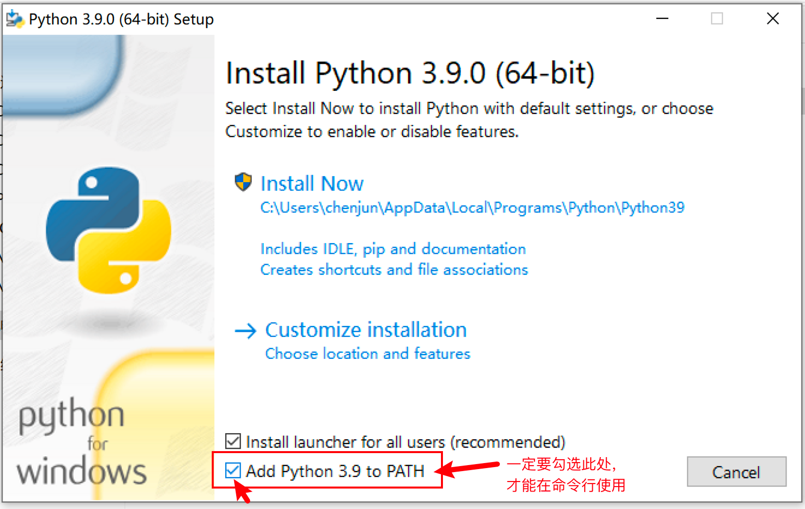
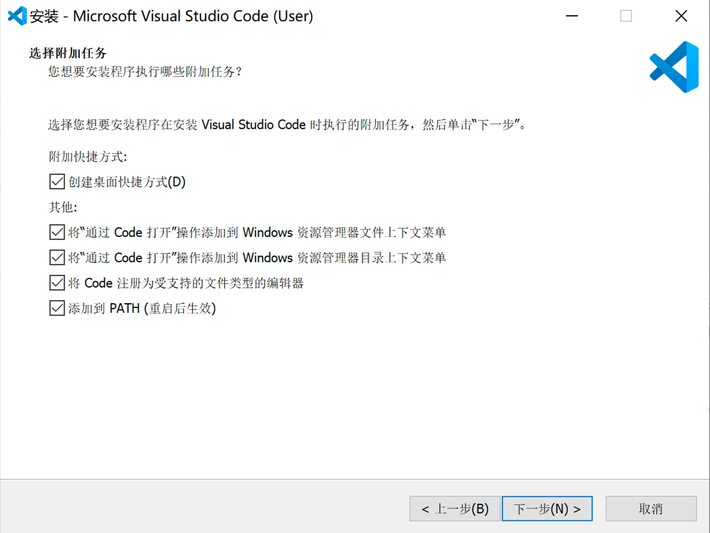
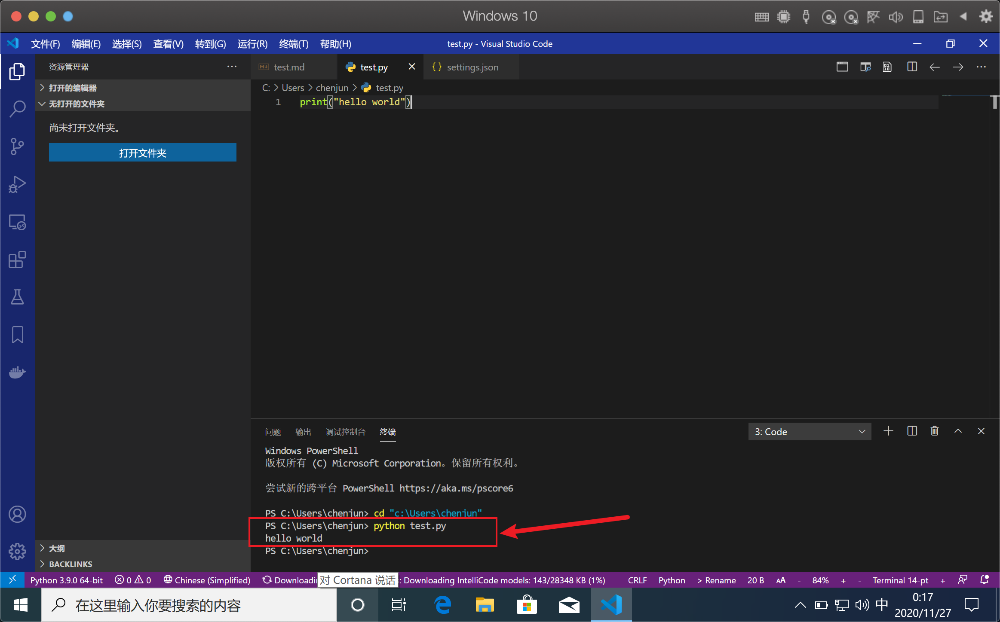

---
## 1. 环境配置

### 1.1. 软件下载及安装

提前准备工作，下载和安装如下软件：
- 腾讯会议（听课使用）: https://meeting.tencent.com/download-center.html
- Python（Python解释器）: https://www.python.org/downloads/release/python-390/
- VsCode（开发环境）: https://code.visualstudio.com/download

---
> **关于下载**
> 
> - 由于Python和VsCode国外源下载较慢，因此已经将下好了文件放置于国内云盘，可以点击以下链接高速下载：  
> - 蓝奏云：https://wws.lanzous.com/b01tr02pa 密码：4i4q  
>  （MAC下载zip格式，WINDOWS下载exe格式）
> 
> ---
> 
> **Windows安装细节**
> 
> 1. Python安装时，注意勾选添加到环境变量，再点Install。  
>   
> 
> 2. Vscode安装，该页面可以选择全部。  
>   
> 
> **MAC基本没啥好说的**
> 
> 基本点默认就完事，其他软件安装类似如: `brew install git`

---
## 2. VsCode编译器设置与完善

使用教程，点击如下链接，查看2.1内容：  
https://wan230114.gitee.io/pythonnote/#/docs/Usage

---
环境搭建完成示意：（以编写脚本并运行以下图示为节点）

  

---
## 3. Python知识大厦建立

见今晚大纲内容

Python是什么？
http://c.biancheng.net/view/130.html

编程语言发展的几个阶段？
