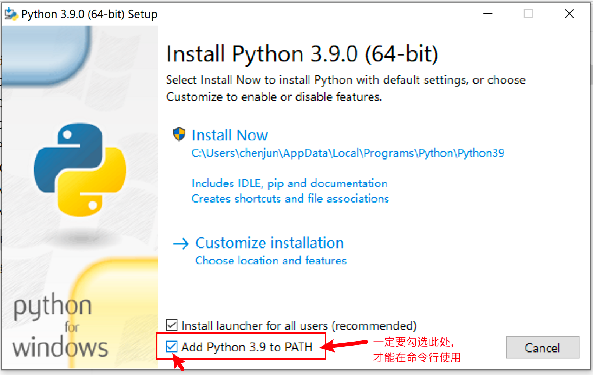
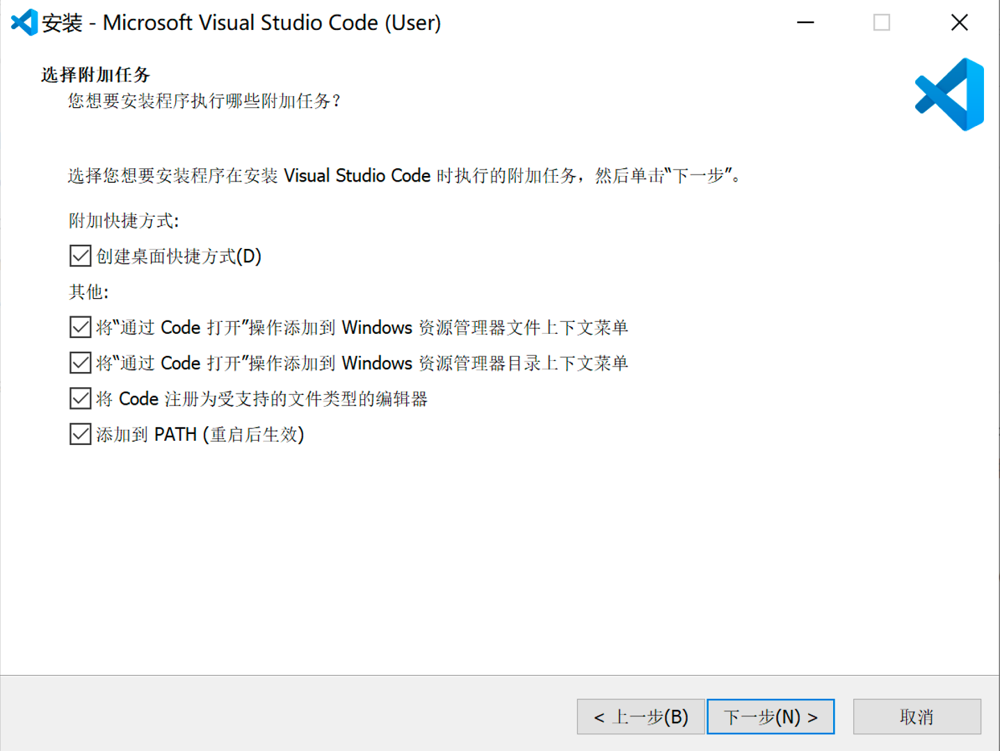

---
## 1. 环境配置

### 1.1. 软件下载及安装

提前准备工作，下载和安装如下软件：
- 听课软件
  - 腾讯会议: https://meeting.tencent.com/download-center.html
  - 华为云会议: https://www.huaweicloud.com/product/meeting/download.html
- Python解释器
  - Python: https://www.python.org/downloads/release/python-390/
- 开发及学习环境
  - VsCode: https://code.visualstudio.com/download

> **关于下载**
> 
> - 由于Python和VsCode属于国外源，下载较慢，此处提供已下载好的文件，点击以下链接高速下载：  
> - 蓝奏云：https://wws.lanzous.com/b01tr02pa 密码：4i4q  
>  （MAC系统下载zip格式，WINDOWS系统下载exe格式）

---

**Windows安装细节**

1. Python安装时，注意勾选添加到环境变量，再点Install。  
  

2. Vscode安装，该页面可以选择全部。  
  

**MAC基本没啥好说的**

基本点默认就完事，其他软件安装类似如: `brew install git`

---
## 2. VsCode编译器设置与完善

使用教程，点击如下链接，查看2.1内容：  
https://wan230114.gitee.io/pythonnote/#/docs/Usage

---
环境搭建完成示意：（以编写脚本并运行以下图示为节点）

  

---
## 3. Python知识大厦建立

见今晚大纲内容

Python是什么？
http://c.biancheng.net/view/130.html

编程语言发展的几个阶段？

# 课后作业

